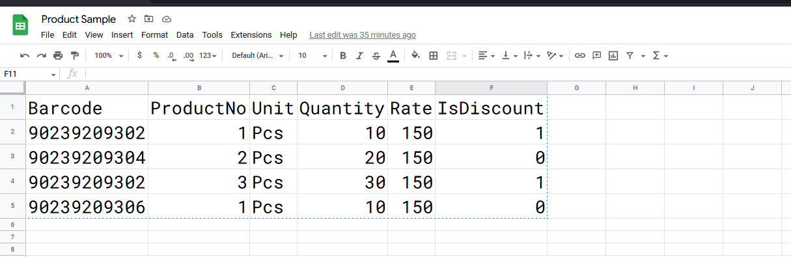

# CSV Paster

csv paster is a library that allows to paste excel/csv format data into a html table on multiple inputes such as normal
input,checkbox,radio and select.

## Preview
https://www.loom.com/share/c6952f01cac34e7cbaf0b6fcd751835d

## Setup

To work with paster, we need to configure our table to tack the changes and make workable paster, steps are as follows

1. table must have id `csv`
2. add data-header attribute on table header with corresponded object keys, after pasting the data paster dispatch
   event `pasteComplete` with current table array for that we need to configure data-header.
3. add class `skip-paste` to skip the paste.
4. add class `watch` to get the updated rows by paster, if we missed class `watch` this does not tack the changes, for
   e.g. we have an input field named barcode. if the barcode changed we need to find the latest paste item to fetch
   product according to barcode, in this case we need to tack the newly updated barcode to fetch the product
5. add class `watch` on `td` element we can ensure current row is watchable or not.

## Events

While pasting the data from csv/excel to web table, we might need some events to make fruitfull dev experiance,
After pasting the data paster dispatch event `pasteComplete` on `tableElem` with current table object, likely in some
cases I found that we need to know, pasted row count before filling data into a table for that paster dispatch `onRows`
event with the lenght of current rows.

## Usages

### excel sample



### table Sample

```html

<table class="table table-sm table-bordered table-strriped" id="csv">
    <thead class="bg-warning">
    <tr>
        <th data-header="barcode">Barcode</th>
        <th data-header="product">Product</th>
        <th data-header="unit">Unit</th>
        <th data-header="quantity">Quantity</th>
        <th data-header="rate">Rate</th>
        <th data-header="isDiscount">Discount</th>
    </tr>
    </thead>
    <tbody>
    <tr>
        <td class="watch">
            <input type="text" class="form-control form-control-sm"/>
        </td>
        <td class="watch">
            <select class="form-control form-control-sm">
                <option>Select Product</option>
                <option value="1">Item 1</option>
                <option value="2">Item 2</option>
                <option value="3">Item 3</option>
            </select>
        </td>
        <td class="watch">
            <input type="text" class="form-control form-control-sm"/>
        </td>
        <td class="watch">
            <input type="text" class="form-control form-control-sm"/>
        </td>
        <td class="watch">
            <input type="text" class="form-control form-control-sm"/>
        </td>
        <td class="watch">
            <input type="checkbox" class="form-check-input" style="width: 2em !important; height: 1.5rem !important;"/>
        </td>
    </tr>
    </tbody>
</table>
```

Event handling for watched changes

```js
document.addEventListener('DOMContentLoaded', () => {
    const tabeleElem = document.querySelector('#csv');
    tabeleElem.addEventListener('pasteComplete', (ev) => {
        console.log(ev.detail);
    });
})
```

event details/response array

```json
[
  {
    "barcode": "Barcode",
    "product": "",
    "unit": "Unit",
    "quantity": "Quantity",
    "rate": "Rate",
    "isDiscount": "false"
  },
  {
    "barcode": "90239209302",
    "product": "1",
    "unit": "Pcs",
    "quantity": "10",
    "rate": "150",
    "isDiscount": "true"
  }
]
```

